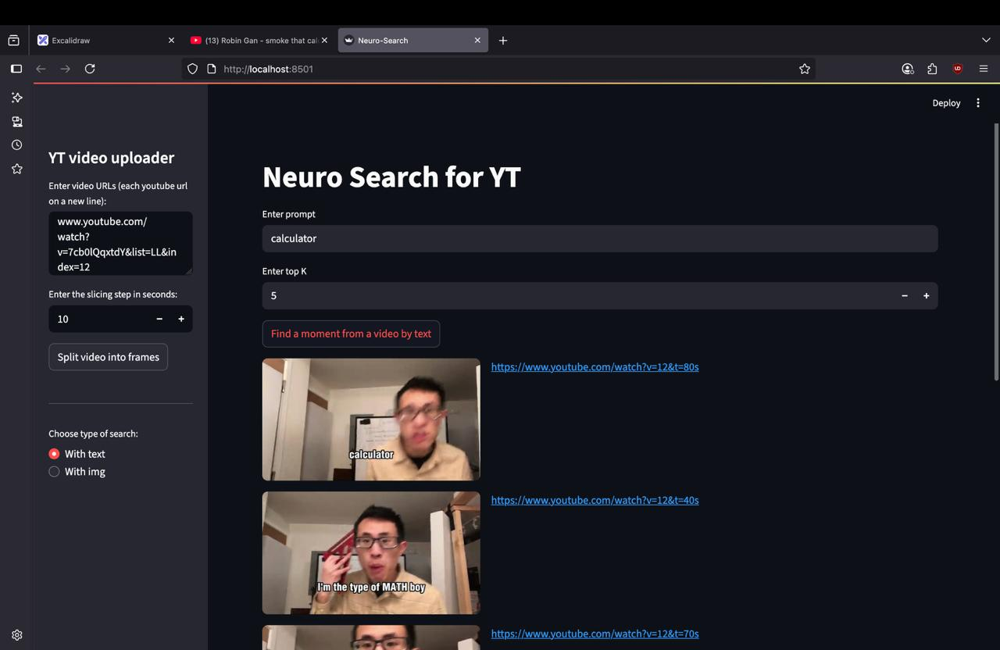

# 🧠 Neuro Search



**Neuro_Search** — interactive Streamlit app for finding key moments in YouTube videos using **text or image prompts** with **CLIP embeddings**.

---

## ✨ Features

* 🎬 **Extract frames from YouTube videos** using `yt-dlp` + `OpenCV`.
* 🖼 **Generate image embeddings** with `CLIP` (transformers).
* 🔍 **Search for similar frames** via cosine/Euclidean distance (`scikit-learn`).
* 🖥 **Interactive web interface** with Streamlit.
* 🔄 **Text-to-image** and **image-to-image** search support.
* ⚡ **GPU & Apple Silicon optimized** for faster inference.

---

## ⚙️ Installation

```bash
git clone https://github.com/username/neuro_search.git
cd neuro_search
python -m venv venv
source venv/bin/activate  # Linux / Mac
venv\Scripts\activate     # Windows
pip install -r requirements.txt
```

---

## 🚀 Usage

```bash
streamlit run app.py
```

1. 📝 Enter YouTube video URLs in the sidebar.
2. ⏱ Split videos into frames at a chosen interval.
3. 🔍 Search frames using a **text prompt** or **uploaded image**.
4. 📂 View **top-K matching frames** with clickable YouTube links.

---

## 🗂 Project Structure

```
neuro_search/
│
├─ app.py             # Main Streamlit app
├─ func.py            # Helper functions (frame extraction, distance, display)
├─ preview.jpg        # App preview image
└─ requirements.txt
```

## 💡 Notes

* ⚡ **Optimized for GPU / Apple Silicon**.
* 🖼 Frames are stored in `images/` and embeddings in `image_embeddings.npy`.
* 🔄 Re-run video splitting if you change the interval or add new videos.

